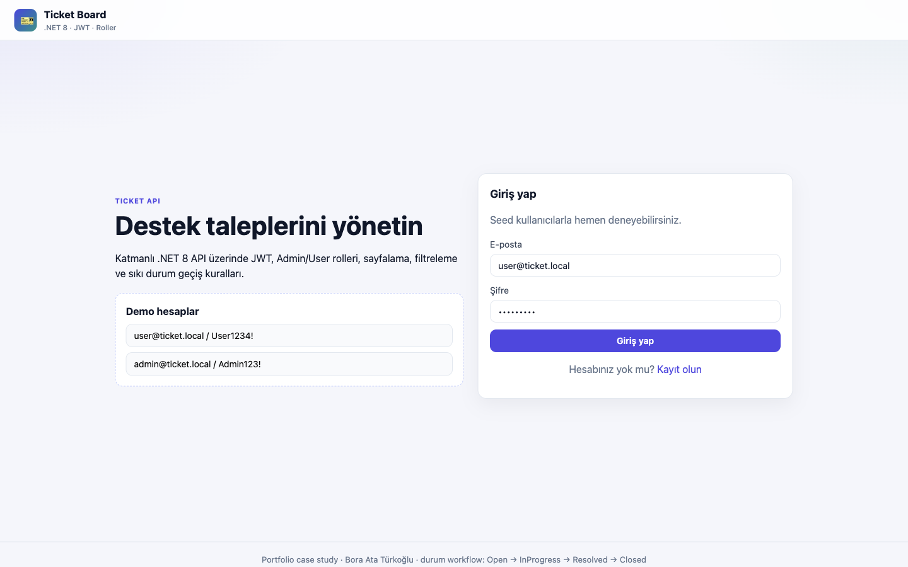
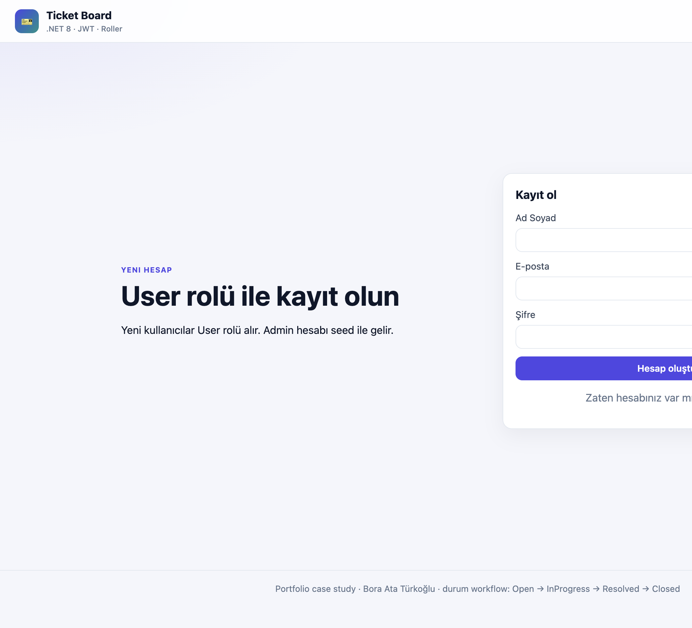
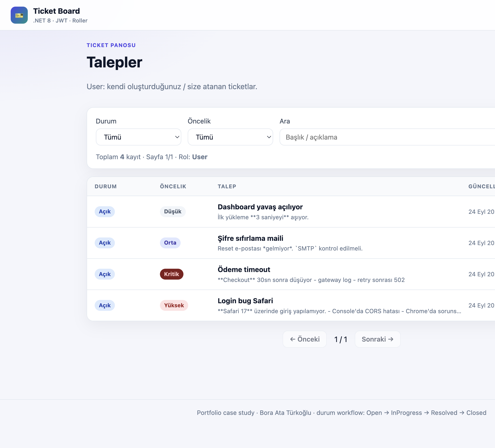
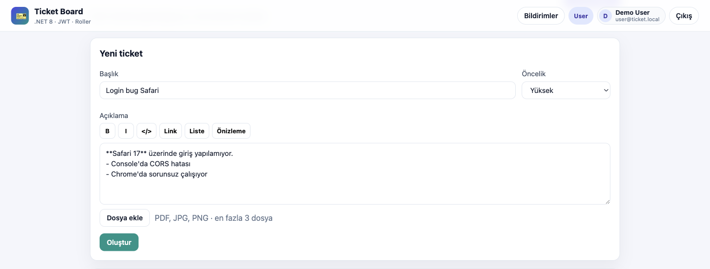
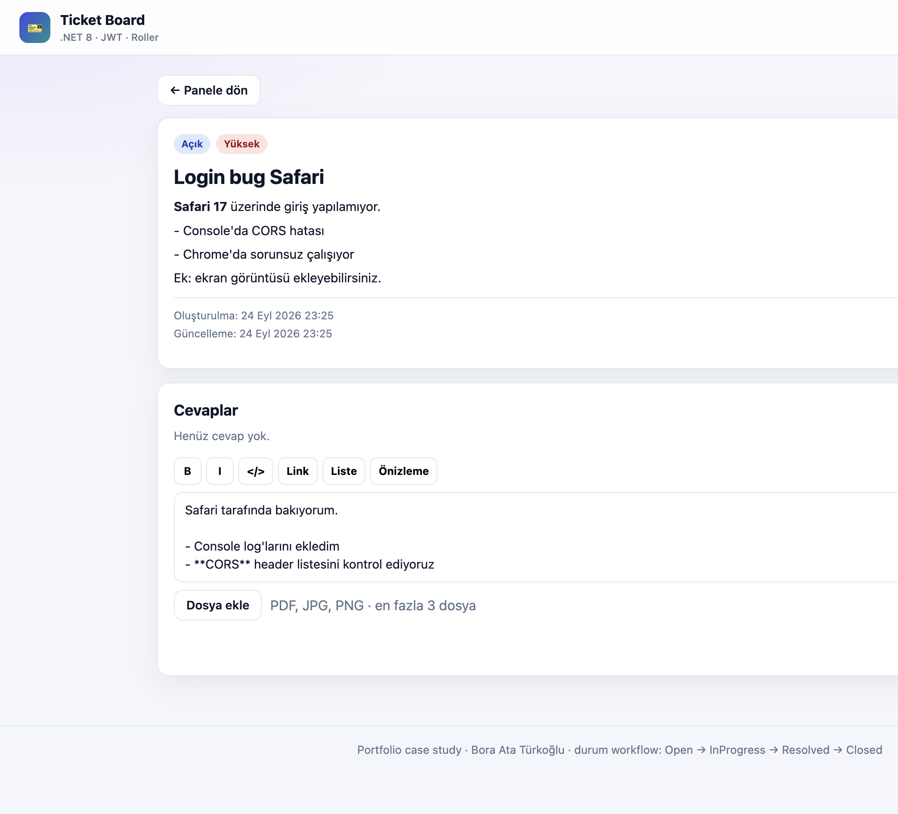
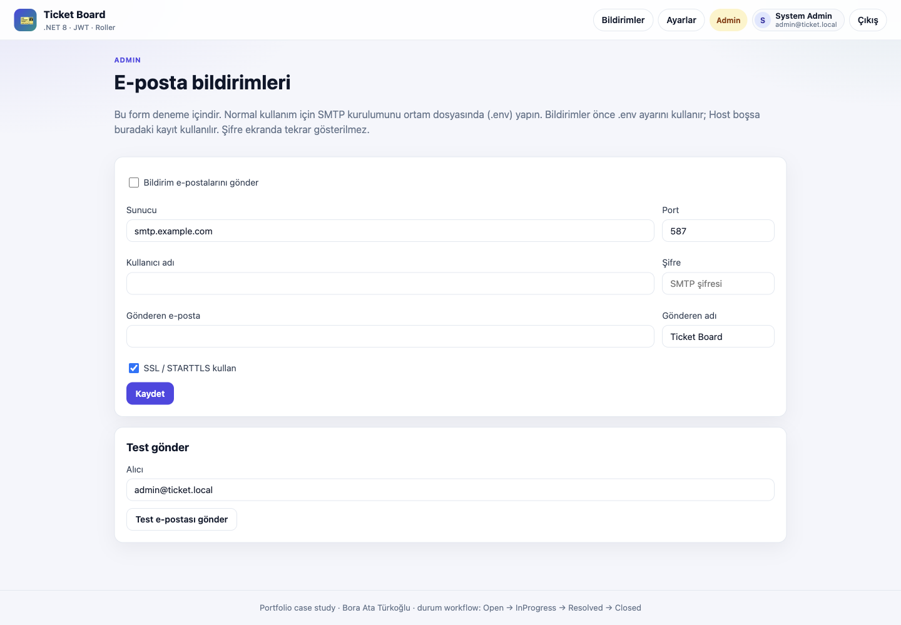

# Ticket API — .NET 8

Layered ticket management API with JWT auth, **Admin/User** roles, pagination, filtering, and a strict status workflow — plus a Turkish React UI (Ticket Board).

> **TR:** Katmanlı ticket API — JWT, Admin/User rolleri, sayfalama/filtreleme, durum geçiş kuralları ve soft UI.

## Architecture / Mimari

```
TicketApi.Api            → Controllers, JWT, Swagger
TicketApi.Application    → Services, DTOs, interfaces
TicketApi.Domain         → Entities & enums
TicketApi.Infrastructure → EF Core, PostgreSQL/SQLite, JWT + password hashing
web/                     → Vite + React + TypeScript UI (Nginx)
```

## Features / Özellikler

- Register / login with JWT
- Tickets: create (User), list/filter, detail; delete & status change (Admin)
- Pagination + filter by `status`, `priority`, `search`
- Status workflow: `Open → InProgress → Resolved → Closed` (illegal transitions → `422`)
- Role rules: users see own/assigned tickets; admins see all
- Replies with Markdown; attachments PDF/JPG/PNG (max 3 files, 5 MB each)
- Email notifications on reply (SMTP via `.env` or admin panel)

### Role rules

| Action | User | Admin |
|--------|------|-------|
| Create ticket | ✓ | ✗ |
| Delete ticket | ✗ | ✓ |
| Change status | ✗ | ✓ |
| Reply (if can view) | ✓ | ✓ |

Anyone who can see a ticket (creator, assignee, or admin) can reply.

**Seed users (first run)**

| Email | Password | Role |
|-------|----------|------|
| admin@ticket.local | Admin123! | Admin |
| user@ticket.local | User1234! | User |

## Quick start — Docker Compose

```bash
cp .env.example .env
docker compose up --build
```

- **Web UI:** http://localhost:3000  
- **API:** http://localhost:8080  
- **Swagger:** http://localhost:8080/swagger  

Ports via `WEB_PORT` (default **3000**), `APP_PORT` (default **8080**), `POSTGRES_PORT`. If a port is already in use, change `WEB_PORT` (or the others) in `.env`.

> Run this stack **or** another app that claims the same defaults (8080/3000/5432) at a time.

## Local (SQLite)

```bash
cd src/TicketApi.Api
dotnet run
# Development profile uses SQLite (appsettings.Development.json)
```

## Local (PostgreSQL)

```bash
docker compose up -d postgres
export ConnectionStrings__Default='Host=localhost;Port=5432;Database=ticket_api;Username=ticket;Password=ticket_secret_change_me'
export Database__Provider=Postgres
dotnet run --project src/TicketApi.Api
```

## Web UI (React)

Soft professional Turkish UI: login/register, ticket board with filters, create ticket (User), detail with Markdown replies + attachments, admin status/delete, and admin SMTP settings.

### Auth — login & register

Login with seed demo accounts, or register a new user.



*Giriş — demo hesaplar ekranda listelenir*



*Kayıt — yeni User hesabı*

### Board

User board: own/assigned tickets, status/priority filters, search, horizontal list, pagination. Admins see all tickets; only Users get “+ Yeni ticket”.



*Pano — filtreler, öncelik etiketleri, sayfalama*

### Create ticket

Markdown toolbar and file attach (PDF/JPG/PNG, max 3 × 5 MB). Admins cannot create tickets.



*Yeni ticket — Markdown + Dosya ekle*

### Ticket detail & replies

Markdown body, reply composer, attachments. Status dropdown is Admin-only. Replies notify by email when SMTP is enabled.



*Detay — Markdown gövde, cevap composer + dosya*

### Local development

```bash
# Terminal 1
cd src/TicketApi.Api && dotnet run

# Terminal 2
cd web && npm install && npm run dev
# → http://localhost:5173
```

### Docker

`docker compose up --build` serves the UI on **:3000** (Nginx → API).

CORS is enabled for `http://localhost:3000` and `:5173`. Enums serialize as strings (`Open`, `High`, …) via `JsonStringEnumConverter`.

## Email / SMTP

When someone replies:

- **User** replies → admins get `"{FullName} cevap verdi"`
- **Admin** replies → ticket owner (and assignee, if any) get `"Admin cevap verdi"`

**Configuration order**

1. Prefer `.env` / Compose env (`SMTP_*` → `Smtp__*`).
2. If `SMTP_HOST` is empty, the API falls back to values saved in the admin Settings form (for local trials).
3. The admin form’s “Test e-postası” uses the form/DB settings (not for production config).

| Env key | Purpose |
|---------|---------|
| `SMTP_HOST` | SMTP server (empty → use admin form / DB) |
| `SMTP_PORT` | Port (default `587`) |
| `SMTP_USERNAME` | Username |
| `SMTP_PASSWORD` | Password |
| `SMTP_FROM_EMAIL` | From address |
| `SMTP_FROM_NAME` | From display name (default `Ticket Board`) |
| `SMTP_ENABLE_SSL` | SSL / STARTTLS (default `true`) |
| `SMTP_ENABLED` | Send notifications (default `false`) |



*Admin — E-posta bildirimleri / SMTP (deneme formu)*

## Tests

```bash
dotnet build
dotnet test
```

## Example

```bash
TOKEN=$(curl -s -X POST http://localhost:8080/api/v1/auth/login \
  -H 'Content-Type: application/json' \
  -d '{"email":"user@ticket.local","password":"User1234!"}' | jq -r .accessToken)

curl -s -X POST http://localhost:8080/api/v1/tickets \
  -H "Authorization: Bearer $TOKEN" \
  -H 'Content-Type: application/json' \
  -d '{"title":"Login bug","description":"Cannot login on Safari","priority":"High"}'
```

## License

MIT — portfolio demo by Bora Ata Türkoğlu.
